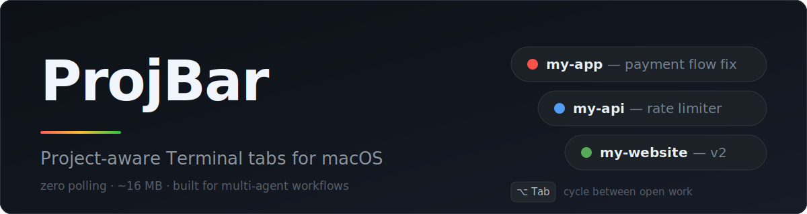
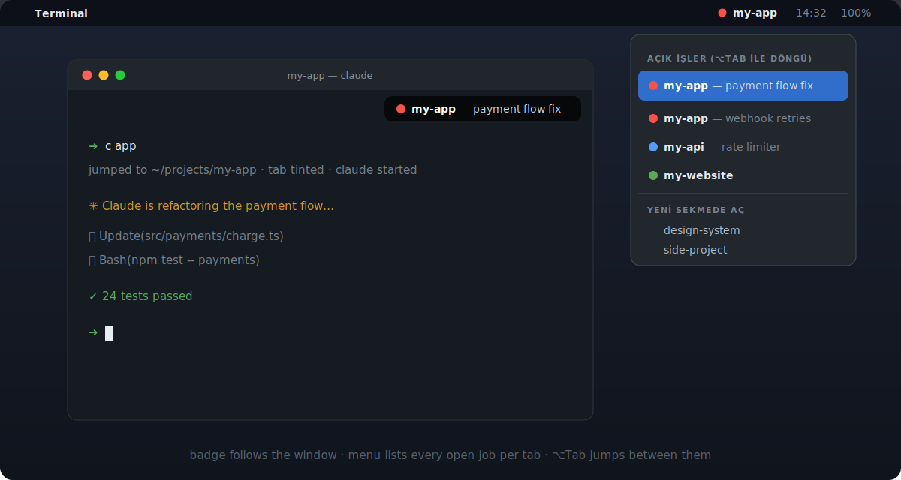

<p align="center">
  
</p>

<p align="center">
  <b>Always know which project you're in — and what you're working on — across every Terminal tab.</b>
</p>

<p align="center">
  
  
  
  
</p>

A tiny macOS menu bar app + shell layer that turns your Terminal tabs into a project-aware workspace. Built for people who juggle many projects in many tabs — especially with AI coding agents like **Claude Code** running in several of them at once.

<p align="center">
  
</p>

## Features

- **Window badge** — a small pill pinned to the top-right of your Terminal window showing `● project — current task`. Follows the window, click-through, hides when Terminal isn't frontmost.
- **Menu bar indicator** — active project name in its own color. Click it for an **open work list**: one row per tab (two jobs in the same project = two rows with their own task labels). Click a row to jump to that tab; closed projects open in a new tab.
- **⌥Tab** — global hotkey that cycles through your open work, from any app.
- **Colored tabs** — `cd` into a project and the tab background tints with the project's color, the title becomes the project name; leave and it restores. Colors are pinned per project or derived deterministically from the name.
- **Claude Code integration (fully automatic)** — a `PostToolUse` hook watches which project each Claude session touches and updates that tab's badge by itself. Tell Claude *"switch to project X"* and the badge follows within one tool call. A `SessionEnd` hook clears the tab's task label when the session exits, so stale labels never linger.
- **Per-tab task labels** — `projtask fixing the login flow` tags *this tab's* work. Claude sessions tag their own tabs via `projbar-task`.

## Design: zero cost at idle

ProjBar is aggressively lazy. There is **no polling loop, no timer, no subprocess spawning** while you work:

- It listens to macOS **Accessibility events** — Terminal itself announces "tab switched / window moved / title changed". Between events the app is fully asleep.
- Shell hooks write tiny state files (`~/.local/state/projbar/`) on `cd`; the app picks changes up through a file-system watcher, instantly.
- Project resolution is cached by window title; the occasional unknown tab costs a single lookup, then never again.
- Measured: **0 subprocess spawns and 0 B memory growth over sustained use, ~0.2% CPU, ~16 MB** (mostly the AppKit baseline every menu bar app pays).

If Accessibility permission isn't granted, it degrades to a gentle adaptive poll and upgrades itself the moment permission appears.

```
zsh hooks (shell/tmux-proj.zsh)          Claude Code hooks (bin/)
      │ cd → write state                       │ tool call → project path
      ▼                                        ▼
        ~/.local/state/projbar/<tty>  ·  task-tty-<tty>
                        │
                        ▼   (FS watcher + AX events)
              ProjBar.app — menu bar + window badge + ⌥Tab
```

## Install

```zsh
git clone https://github.com/hasaneyldrm/projbar && cd projbar
./install.sh     # copies scripts to ~/.local/bin, wires ~/.zshrc, builds & launches the app
```

Then, one-time setup:

1. **Automation permission** — macOS asks "ProjBar wants to control Terminal" on first run → Allow.
2. **Accessibility permission** — System Settings → Privacy & Security → Accessibility → enable ProjBar (this unlocks the zero-polling event mode).
3. **Claude Code hooks** (optional but the best part) — merge `config/claude-hook-snippet.json` into `~/.claude/settings.json`, replacing `$HOME` with your home path.
4. Want it at login? System Settings → General → Login Items → add `~/Applications/ProjBar.app`.

Requires macOS 13+, Xcode command line tools (for `swiftc`), and zsh.

## Commands

| Command | What it does |
|---|---|
| `pj <name>` | jump to a project in **this** tab (color + title applied) |
| `c <name>` | jump to a project in this tab **and start `claude`** |
| `projtask <text>` | set this tab's task label (`projtask -` clears) |
| `proj <name>` / `p <name>` | open the project as a colored tmux session (`p` starts claude inside) |
| `projbar-set <name> [task]` | (for scripts/agents) set this tab's badge explicitly |
| `projbar-task <text>` | (for Claude sessions) set this tab's task label |

Short names and fuzzy matching work everywhere: `pj app`, `c api`, …

## Configuration

Everything lives at the top of `~/.tmux-proj.zsh`:

- `PROJ_BASE` — your projects root (default `~/Documents/projects`)
- `PROJ_COLORS` — pin a 256-color code per project; unknown projects get a stable auto color
- `PROJ_ALIAS` — short names (`app` → `my-app`)
- `PROJ_AUTOTHEME=0` — disable tab tinting
- `PROJ_BG_STRENGTH` — tint intensity in % (default 35)

## Limitations

- Terminal.app only (iTerm2/Ghostty/kitty not supported yet).
- Tab identity is derived from window titles; two plain-shell tabs with byte-identical titles can't be told apart (Claude Code tabs always have unique titles, so they're fine).
- ⌥Tab may collide with an app that claims the same shortcut.

## License

[MIT](LICENSE)
